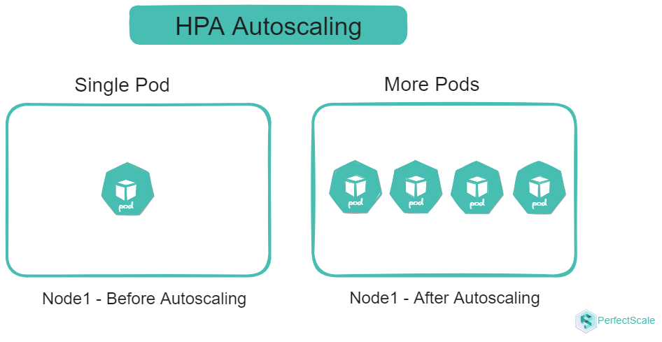

title: The Kubernetes Cost Optimization Guide

# HPA - The Horizontal Pod Autoscaler

Horizontal Pod Autoscaler (HPA) in Kubernetes is a controller that automatically adjusts the number of pods based on observed CPU or memory utilization (default mode) or other metrics. The goal of HPA is to ensure that applications can handle varying loads efficiently by scaling out (increasing the number of pods) during high demand and scaling in (decreasing the number of pods) during low demand. This dynamic scaling helps maintain resource utilization and application performance. HPA continuously monitors the specified metrics and adjusts the replica count to match the desired state, ensuring that the application remains responsive. 



## How HPA works
HPA works as a control loop that runs at regular intervals. During each interval, the HPA controller queries the resource utilization metrics specified in the HPA configuration. The controller identifies the target resource defined by the `scaleTargetRef` field in the HPA configuration. It then selects the pods based on the target resource's selector labels and fetches the relevant metrics. For CPU and memory metrics, the controller uses the resource metrics API. For custom metrics, it uses the custom metrics API. If you want to create your own custom metrics adapter, take a look at the starter [template] (https://github.com/kubernetes-sigs/custom-metrics-apiserver)


For metrics of individual pod resources, such as CPU usage, the HPA controller collects data for each pod that it targets. When a target utilization value is specified, the controller calculates the CPU utilization as a percentage of the resource request defined for each container within the pod. If any containers within a pod lack the necessary resource request settings, the CPU utilization for that pod will not be defined, and the autoscaler will not take any action based on the metric.

HPA generally retrieves metrics from aggregated APIs like `metrics.k8s.io`, `custom.metrics.k8s.io`, or `external.metrics.k8s.io`. The `metrics.k8s.io` API is generally provided by an add-on called Metrics Server, which must be deployed separately.

The Horizontal Pod Autoscaler (HPA) uses a straightforward algorithm to adjust the number of pod replicas based on the ratio of current metric values  to desired metric values. The core formula is:

```
desiredReplicas = ceil[currentReplicas * ( currentMetricValue / desiredMetricValue )]
```

For example, if the current CPU usage is 300m and the target is 150m, the number of replicas will double because  `300.0 / 150.0 = 2.0`. Conversely, if the current usage is 75m, the replicas will be halved because `75.0 / 150.0 = 0.5`.

## Kubernetes HPA Shortcomings - Cost and Performance

1. **Metric Constraints and Conflicts**:  HPA cannot be used with VPA when both are based on CPU or memory metrics. This is because VPA adjusts resource requests and limits, which can conflict with HPA's scaling decisions. This limitation can lead to suboptimal resource allocation, impacting both cost efficiency and performance.
2. **Limited Resource Consideration**: HPA doesn't consider IOPS, network bandwidth, or storage usage in its scaling decisions. This oversight can lead to performance bottlenecks or outages if these resources become constrained, potentially resulting in poor user experience and increased operational costs to address these issues reactively.
3. **Granularity and Resource Waste**: HPA scales at the pod level, which may not provide the fine-grained control needed for certain applications. This can result in over-scaling or under-scaling, impacting both application performance and resource utilization. Moreover, HPA doesn't address resource waste within the Kubernetes cluster, leaving administrators responsible for identifying and managing unused or over-provisioned resources at the container level. This can lead to inefficiencies and increased costs if not carefully monitored.
4. **Scaling Latency and Stability**: HPA operates on a polling interval (default 15 seconds), introducing a delay between detecting a need for scaling and implementing the change. This latency can be problematic during sudden traffic spikes, potentially leading to temporary performance degradation. To compensate, administrators might set more aggressive scaling parameters, potentially increasing resource costs. Moreover, without proper cooldown periods, HPA can cause rapid scaling up and down, leading to instability or "flapping". Careful configuration of stabilization windows is necessary to ensure stable scaling behavior, adding to management complexity.
5. **Resource Utilization Fluctuations**: HPA makes scaling decisions based on current resource utilization metrics, which can be challenging for workloads with high variability. This can lead to "thrashing," where the system rapidly scales up and down in response to short-term fluctuations. Thrashing impacts both performance stability and cost efficiency, as each scaling operation consumes resources and can incur additional costs, especially in cloud environments.
4. **Sampling rate limitations**: Kubernetes' default configuration can hinder HPA's effectiveness for applications with rapidly changing workloads. The default metric collection interval of 15 seconds may not provide sufficiently granular data for making timely scaling decisions in highly dynamic environments. This limitation can result in delayed responses to changing conditions, potentially leading to performance issues during traffic spikes and inefficient resource utilization during lulls. This coarse sampling might lead to over-provisioning as a safety measure, increasing overall resource costs.
5. **Lack of Predictive Scaling**: HPA's reactive approach, which responds to current conditions rather than anticipates future needs, can be suboptimal for applications with predictable traffic patterns or scheduled events. This can lead to temporary performance degradation during regular traffic spikes and impact cost efficiency, as resources are not preemptively allocated for known high-traffic periods.
6. **Cold Start Inefficiency**: When new pods are created in response to increased demand, they require time to become fully operational. This includes time for container image pulling, application startup, and potentially warming up caches or establishing connections. During this period, the newly created pods consume resources but may not yet be able to handle their full share of the workload. This can lead to temporary resource inefficiency and potential performance impact during the scaling process. During a cold start, you're essentially paying for resources that are not yet fully utilized, which can impact overall cost efficiency, especially in environments with frequent scaling events.

## Optimizing HPA for Cost and Performance:


1. **Right-size your pods**: Right-sizing your pods is a critical step in optimizing HPA for both cost and performance. By carefully configuring your pods with appropriate resource requests and limits, you create a more accurate baseline for HPA to make scaling decisions. This precision prevents unnecessary scaling events, which can lead to wasted resources and increased costs. 

2. **Implement pod disruption budgets**: Implementing Pod Disruption Budgets (PDBs) is an essential strategy for maintaining application stability during scaling events, which directly impacts both performance and cost efficiency. PDBs ensure that a minimum number of pods remain available during voluntary disruptions, such as node drains or cluster upgrades. This guarantee of minimum availability prevents performance degradation during scaling operations, ensuring that your application continues to serve requests effectively. PDBs help avoid scenarios where excessive pod terminations might trigger unnecessary scale-up events, thus preventing wasteful resource allocation and associated costs.

    An example of a PDB:

```yaml
        apiVersion: policy/v1beta1
        kind: PodDisruptionBudget
        metadata:
        name: my-app-pdb
        spec: 
        minAvailable: 2 
        selector: 
            matchLabels:
                app: my-app
```
3. **Utilize custom metrics**: Instead of relying solely on generic CPU and memory metrics, custom metrics allow you to scale based on application-specific indicators that truly reflect your workload's needs. This approach leads to more precise and effective scaling decisions, ensuring that you're allocating resources where they're most needed. By scaling based on metrics that directly correlate with your application's performance, you can maintain optimal user experience while avoiding overprovisioning helps in optimizing both performance and cost.


4. **Adjust HPA parameters**: Adjusting HPA parameters, particularly scaleUpStabilizationWindowSeconds and scaleDownStabilizationWindowSeconds, is crucial for fine-tuning your autoscaling behavior. These parameters help reduce thrashing – rapid scaling up and down – which can negatively impact both performance and cost. By setting appropriate stabilization windows, you give your system time to stabilize after a scaling event before making new scaling decisions. This approach prevents unnecessary scaling operations, reducing the associated performance overhead and resource costs.

```yaml
        behavior:
        scaleDown:
            stabilizationWindowSeconds: 300
            policies:
            - type: Percent
            value: 100
            periodSeconds: 15
```

5. **Implement cluster autoscaling**: Implementing cluster autoscaling in conjunction with HPA provides a more holistic approach to resource management, optimizing both performance and cost at the cluster level. While HPA ensures that your application has the right number of pods, cluster autoscaling ensures that your Kubernetes cluster has enough nodes to accommodate these pods. This synergy prevents scenarios where HPA decisions are constrained by cluster capacity, ensuring that your application can scale as needed for optimal performance. Cluster autoscaling allows you to efficiently utilize cloud resources, scaling your infrastructure up or down based on actual demand, thus avoiding the costs associated with over-provisioned clusters.

6. **Consider alternative solutions**: Considering alternative solutions like the Kubernetes Event-Driven Autoscaler (KEDA) or custom autoscaling solutions can provide more granular control and predictive scaling capabilities for applications with complex requirements. These advanced solutions can optimize performance by reacting more quickly to changes in workload or even anticipating them. The ability to scale more precisely and proactively can lead to significant savings by ensuring that resources are allocated only when truly needed and in the right quantities.

